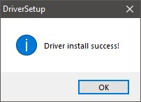
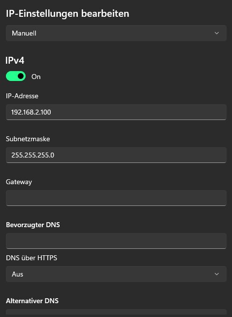
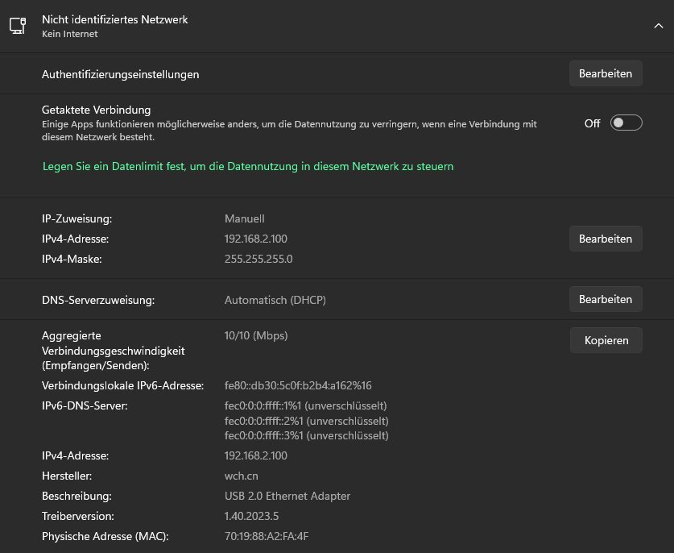

# Kmbox-Net-guide
If this is your first time using Kmbox NET and didn't flash it with latest Firmware check [Kmbox-Net-Flash-guide.](https://github.com/KL-PL1/Kmbox-Net-Flash-guide.)

1. Connect the Kmbox according to the picture. 
2. Run WCHUSBNIC as admin on second PC.
3. 
4. and atfer the install this should show up.
5. 
6. This massage only appears when you install the driver for the first time.
7. Go On your Second Pc Windows Setting search network and Internet look for you Kmbox and set this 
8. Leave the other fields empty and click OK
9. How the kmbox should look like on your second PC now 
10. You are Ready to use Kmbox on your dma cheat.
