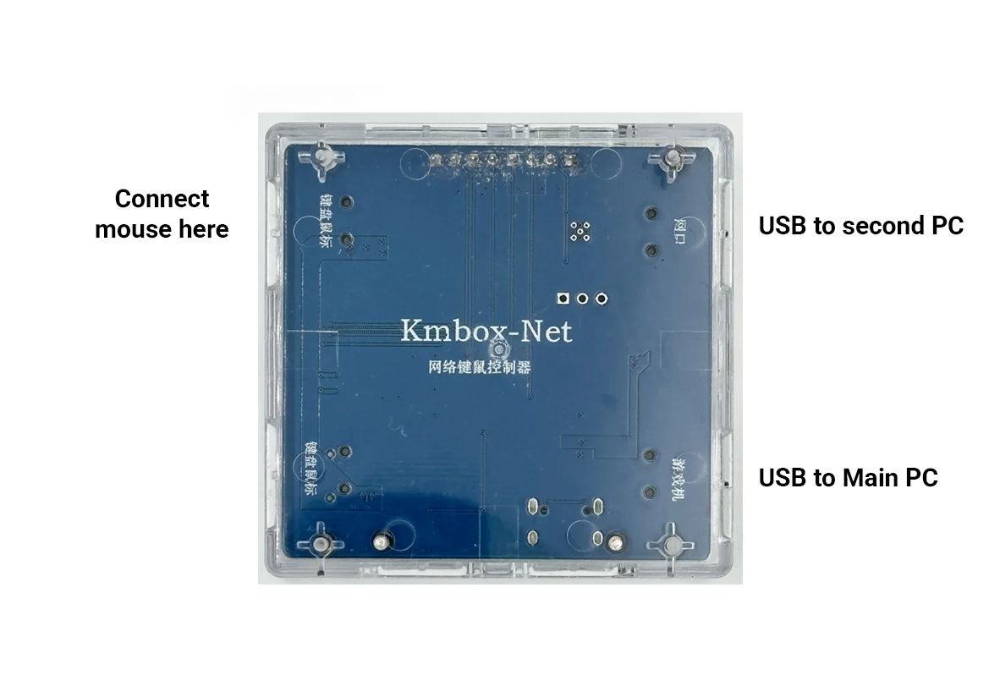

# Kmbox-Net-guide
1. Connect the Kmbox according to the picture.
2. 

3. Run 2. WCHUSBNIC as admin on second PC Image  
4.
5.
6.
7. and atfer the install Image   This massage only appears when you install the driver for the first time.

8. Go On your Second Pc Windows Setting search network and Internet look for you Kmbox Image and set this Image (Enter here)

IP address: 192.168.2.100

Subnet mask: 255.255.255.0

Leave the other fields empty

And click OK

4. How the kmbox should look like on your second PC now Image (How it should look like)

You are Ready to use Kmbox on your dma cheat.
